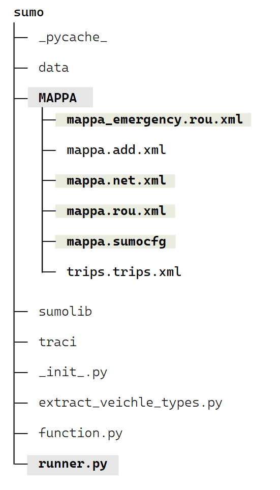
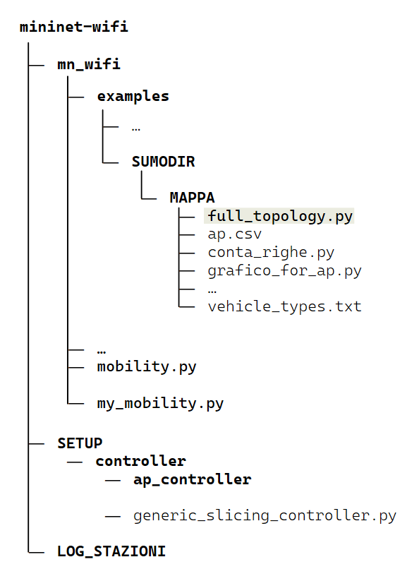

# CARTELLA DI IMPLEMENTAZIONE DI UN MODELLO URBANO CON MECCANISMI DI SLICING DINAMICO 

## Crediti e Licenza

Questa repository contiene una versione modificata di Mininet-WiFi, utilizzata per simulazioni urbane con **SUMO** e per l’implementazione di **Wi-Fi slicing dinamico**.
Il codice originale è rilasciato sotto la licenza Mininet-WiFi 2.6, che consente l’uso, la modifica e la ridistribuzione del software.
In conformità alla licenza, questa repository include il notice originale ed evita l’uso di nomi o marchi degli autori per fini pubblicitari.

# Nuovi file e cartelle 
Rispetto alla versione originale, questo progetto include:
## file di creazione della rete stradale SUMO

- `mappa.osm` – esportazione della mappa OpenStreetMap  
- `mappa.net.xml` – rete SUMO generata con *netconvert*  
- `mappa.rou.xml` – rotte standard dei veicoli  
- `mappa_emergency.rou.xml` – rotte con veicoli di emergenza  
- `mappa.sumocfg` – file di configurazione principale SUMO  
- `mappa.add.xml` – file additional SUMO
- `mn_wifi/sumo/runner.py` – modificato per utilizzare la configurazione SUMO personalizzata
  
## file di creazione della topologia e di imlementazione della simulazione

- `full_topology.py` – base fondamentae di tutto il progetto di tesi, oltre a definire la topologia personalizzata per Mininet-WiFi si occupa di coordinare i vari thread di controllo ed esecuzine dello slicing
- `ap.csv` – elenco Access Point ottenuto dagli OpenData  
- `my_mobility.py` – estensione del modulo di mobilità `mobility.py` con modifiche inerenti all'avvio automatico degli iperf
- `grafico_for_ap.py` – programma python per la creazione dei grafici, i risultati di trovano nella cartella `grafci_output`
- `SETUP/controller/generic_slicing_controller.py` file di controllo delle slice, esso impiega tutto il meccansimo di suddivisione dinamica

### file autogenerati 

#### file di setup degli ap 
si trovano nella cartella `SETUP/controller/ap_controller`

#### file di log 
cartella `LOG_STAZIONI` contiene tutti i log con i risultati di tutte le comunicazioni di un determinato veicolo con un ap

#### file di salvataggio delle posizioni
sono generati automaticamante all'avvio della simulazione e si trovano nella cartella `examples/SUMODIR/MAPPA/`

---
## installazione ed esecuzione
###### _NB: per fare andare il progetto é necessario aver installato sumo_
### 1. Clonare la repository 
`git clone https://github.com/ElliVin/Mininet-wifi-slicing-project-tesi.git`
### 2. entrare nella cartella 
`cd Mininet-wifi-slicing-project-tesi/mininet-wifi`
### 3. installazione: 
`sudo util/install.sh -Wlnfv`
### 4. esecuzione della simulazione 
`cd examples/SUMODIR/MAPPA/full_topology.py`
`sudo python3 full_topology.py`

